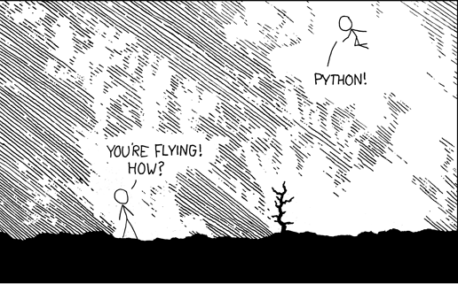
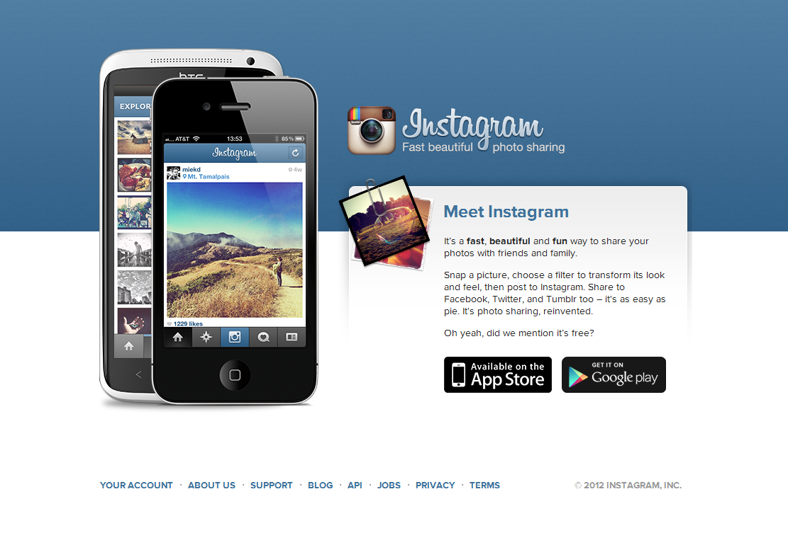
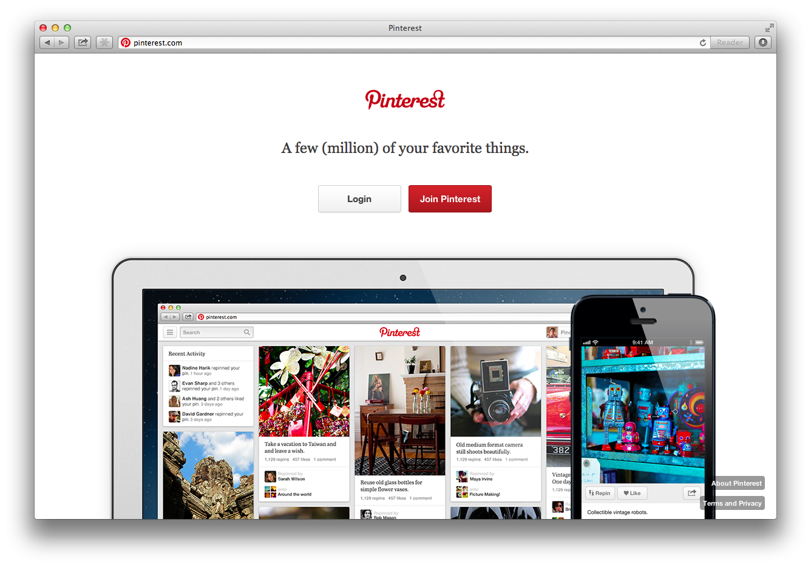

=========================
CSIPy : The Python primer
=========================

Hi !
====

Welcome to this introductory Python workshop.

This will be a primarily hands-on workshop. You'll also have some simple exercises to work on. 

Make sure you have Python installed, and available on PATH.

If you have trouble, ask one of us around.

Hi !
====

Remember when you started with 

.. code-block:: c

	#include<stdio.h>
	int main() {
		printf("Hello world !");
		return 0;
	}

Now it's time for 

.. code-block:: python

	print 'Hello world !'

What is Python ?
================

Python is a dynamically-typed language, initially designed for scripting but later used as a general-purpose language. The primary emphasis is on code readability and expressing ideas in as few lines as possible.

It was first released in 1991 (yes, Python is older than Java!) and was created by a man named Guido van Rossum, a former Google employee, who currently works at Dropbox.

Why Python ?
============

* Improved development time
* Easy-to-learn syntax
* ``>>> import anything``
* Awesome community
* Getting involved with open source

Who uses Python ?
=================

Who uses Python ?
=================

.. image:: ./ui/img/youtube.png
	:align: center
	:scale: 50

Who uses Python ?
=================

Who uses Python ?
=================

.. image:: ./ui/img/dropbox.png
	:align: center
	:scale: 100

Who uses Python ?
=================

.. image:: ./ui/img/reddit.jpg
	:align: center
	:scale: 100

Who uses Python ?
=================

.. image:: ./ui/img/nasa.jpg
	:align: center
	:scale: 100

Who uses Python ?
=================

Who uses Python ?
=================

Who uses Python ?
=================

What can I do with Python ?
===========================

- Build web apps
- Scientific computing
- Web scraping & indexing
- Data analysis & visualization
- Hardware interfacing
- Pretty much anything else you need

The Python community
====================

.. image:: ./ui/img/github.png
	:align: center

The Python community
====================

Let's get started !
===================

Fire up the terminal ! Let's dive into Python !

