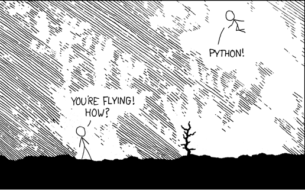

=========================
CSIPy : The Python primer
=========================

Hi !
====

Welcome to this introductory Python workshop.

This will be a primarily hands-on workshop. You'll also have some simple exercises to work on. 

Make sure you have Python installed, and available on PATH.

If you have trouble, ask one of us around.

What is Python ?
================

Python is a dynamically-typed language, initially designed for scripting but later used as a general-purpose language. The primary emphasis is on code readability and expressing ideas in as few lines as possible.

It was first released in 1991 (yes, Python is older than Java!) and was created by a man named Guido van Rossum, who is a former employee of Google and currently works at Dropbox.

